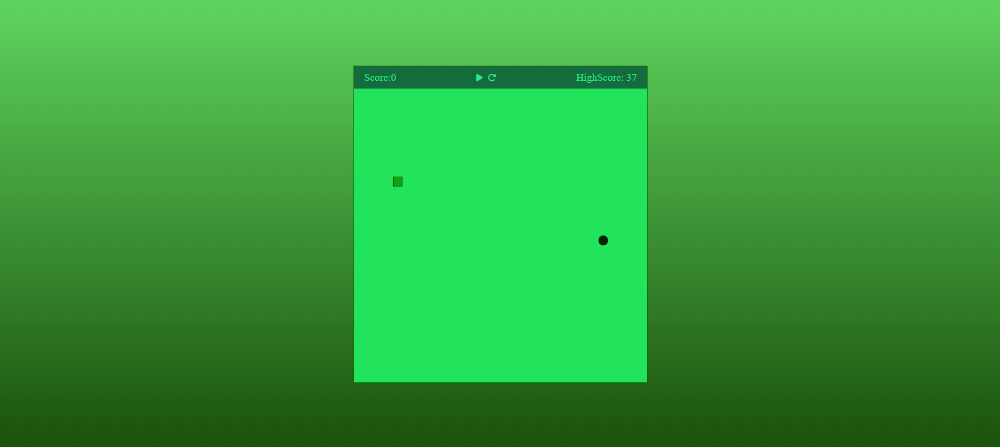

# Snake Game

This is a simple implementation of the classic Snake game using HTML, CSS, and JavaScript.

## Play the Game

You can play the game [here](https://snake-smith.netlify.app/).

## How to Play

- Use the arrow keys to control the direction of the snake.
- Eat the food (red squares) to grow longer.
- Avoid running into the walls or into the snake itself.
- The game ends when the snake collides with a wall or with itself.

## Features

- Responsive design, playable on both desktop and mobile devices.
- Scoreboard to keep track of your points.

## Author

Made By Soumyajoy Pal.

